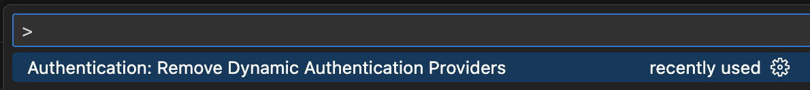
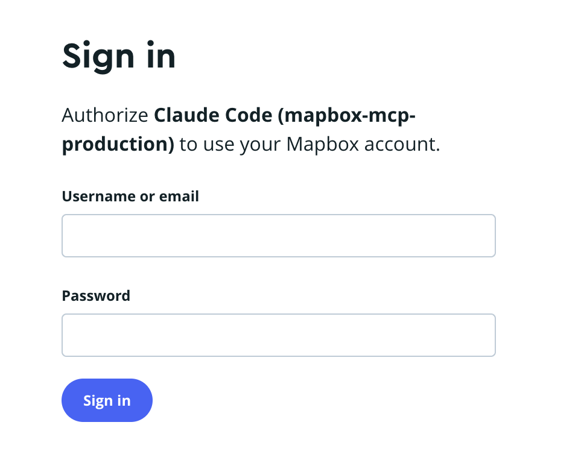

# Hosted MCP Server User Guide

The Mapbox hosted MCP server provides direct access to all Mapbox geospatial tools without requiring local installation or setup.

## 1. Endpoint

**Production endpoint**: `https://mcp.mapbox.com/mcp`

**Protocol support**: Currently supports Streamable HTTP transport. SSE support may be added based on user feedback and requirements.

## 2. Client Setup Instructions

Each MCP client has its own configuration process for the hosted MCP server. Below are instructions for the most widely used clients.

### 2.1 Claude Code

Add the Mapbox MCP server before starting Claude Code:

```bash
claude mcp add --transport http mapbox-mcp-production https://mcp.mapbox.com/mcp
```

Then start Claude Code and run `/mcp` to initialize the connection:

```bash
claude
/mcp
```


Follow the authentication flow described in Section 3.

### 2.2 Claude Desktop

1. Open Claude Desktop settings
2. Navigate to Developer → Edit Config
   
3. Add the Mapbox MCP server configuration:

> **Note**: Claude Desktop currently requires `mcp-remote` as middleware to connect to hosted endpoints.

```json
{
  "mcpServers": {
    "mapbox-mcp": {
      "command": "npx",
      "args": ["mcp-remote", "https://mcp.mapbox.com/mcp"]
    }
  }
}
```

4. Restart Claude Desktop
5. The authentication page will open automatically - follow the authentication flow in Section 3.

### 2.3 VS Code

1. Enable MCP in VS Code ([refer to VS Code MCP documentation](https://code.visualstudio.com/docs/copilot/customization/mcp-servers))
2. Create or edit your `mcp.json` configuration file:

```json
{
  "servers": {
    "mapbox-mcp": {
      "type": "http",
      "url": "https://mcp.mapbox.com/mcp"
    }
  }
}
```

3. Save the configuration
4. Refresh the MCP service if needed
     
   
5. Follow the authentication flow in Section 3
   

> **Tip**: To clear authentication data, press `Cmd + Shift + P` and search for "Authentication: Remove Dynamic Authentication Providers"

### 2.4 Cursor

1. Create an `mcp.json` file in either:

   - Project local: `.cursor/mcp.json`
   - Global: `~/.cursor/mcp.json`

2. Add the following configuration:

```json
{
  "mcpServers": {
    "mapbox-mcp": {
      "url": "https://mcp.mapbox.com/mcp"
    }
  }
}
```

3. In Cursor settings, click "Needs authentication" when prompted
4. Follow the authentication flow in Section 3

### 2.5 OpenAI Chat

1. Navigate to OpenAI's edit prompt page
   
2. Click "Add tools" → "Add server"
3. Configure the connection:
   - **URL**: `https://mcp.mapbox.com/mcp`
   - **Authentication**: Custom headers
   - **Header name**: `authorization`
   - **Header value**: `Bearer <your_mapbox_access_token>`
     
4. Click "Connect" and wait for confirmation
   
5. Select the tools you want to add
   
6. Click "Add" to complete setup

You can now send prompts to test the integration.

## 3. Authentication

The hosted MCP server supports two authentication methods:

### 3.1 OAuth Flow (Interactive)

1. **Login prompt**: After configuring your MCP client, a browser window opens asking you to log in to your Mapbox account
   
2. **Authorization**: Once logged in, click "Allow" on the authorization page to grant permissions
   
3. **Confirmation**: You'll see a success screen, and your MCP client will display a confirmation message

### 3.2 Bearer Token (API Access)

For programmatic access, use your Mapbox access token directly in API calls (see Section 4).

## 4. Direct API Access

For programmatic integration, you can call the hosted MCP server directly using your Mapbox access token. This is ideal for backend scripts, testing, and automation.

### 4.1 Prerequisites

- Valid Mapbox access token with appropriate scopes
- HTTP client (curl, Node.js fetch, Python requests, etc.)

### 4.2 Protocol

The server uses JSON-RPC 2.0 protocol with these required fields:

- `jsonrpc`: "2.0"
- `method`: The operation to perform
- `params`: Operation parameters
- `id`: Request identifier

**Endpoint**: `https://mcp.mapbox.com/mcp`

### 4.3 Available Operations

#### List Available Tools

Retrieve all supported tools and their schemas:

```bash
curl 'https://mcp.mapbox.com/mcp' \
  -H 'authorization: Bearer <your_mapbox_token>' \
  -H 'accept: application/json, text/event-stream' \
  -H 'content-type: application/json' \
  --data-raw '{"method":"tools/list","params":{},"jsonrpc":"2.0","id":1}'
```

**Example Response (simplified)**

```json
{
  "result": {
    "tools": [
      {
        "name": "version_tool",
        "description": "Get the current version information of the MCP server",
        "inputSchema": {
          "type": "object",
          "properties": {},
          "additionalProperties": false,
          "$schema": "http://json-schema.org/draft-07/schema#"
        }
      },
      {
        "name": "category_search_tool",
        "description": "Return all places that match a category...",
        "inputSchema": {
          "type": "object",
          "properties": {
            "category": {
              "type": "string",
              "description": "The canonical category ID to search for..."
            }
          }
        }
      }
    ]
  },
  "jsonrpc": "2.0",
  "id": 1
}
```

#### Execute a Tool

Call a specific tool with parameters:

```bash
curl 'https://mcp.mapbox.com/mcp' \
  -H 'accept: application/json, text/event-stream' \
  -H 'authorization: Bearer <your_mapbox_token>' \
  -H 'content-type: application/json' \
  --data-raw '{
    "method": "tools/call",
    "params": {
      "name": "category_search_tool",
      "arguments": {
        "category": "coffee_shop",
        "limit": 5,
        "proximity": {"longitude": -122.4075, "latitude": 37.788},
        "format": "formatted_text"
      }
    },
    "jsonrpc": "2.0",
    "id": 2
  }'
```

**Example Response (simplified)**

```json
{
  "result": {
    "content": [
      {
        "type": "text",
        "text": "1. Starbucks\n   Address: 170 O'farrell St, San Francisco, CA\n   Coordinates: 37.7868, -122.4073\n   Category: coffee shop, café\n\n2. Bluestone Lane\n   Address: 562 Sutter St, San Francisco, CA\n   Coordinates: 37.7891, -122.4098\n   Category: café, coffee shop"
      }
    ],
    "isError": false
  },
  "jsonrpc": "2.0",
  "id": 0
}
```
